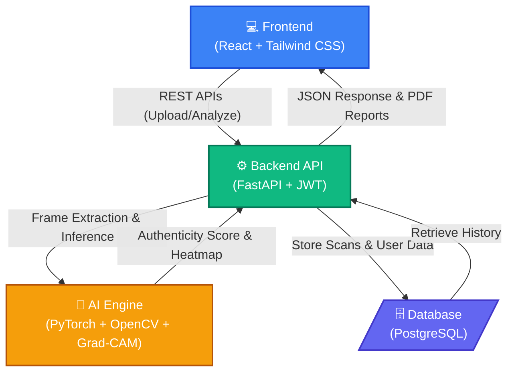

# 🛡️ TrustVision AI

> AI-Powered Media Authenticity & Deepfake Detection Platform

TrustVision AI is an enterprise-grade deepfake detection and media authenticity verification platform built using modern full-stack architecture and deep learning. It detects manipulated digital media (images and videos) using CNN-based models with explainable AI capabilities and real-time analysis features.

---

## 🚀 Vision

To restore trust in digital media by building a scalable AI platform capable of detecting synthetic and manipulated content across multiple modalities.

---

## 🧠 Core Capabilities

- Deepfake Image Detection
- Video Frame-Level Analysis
- Real-Time Webcam Detection
- Explainable AI (Grad-CAM Visualization)
- Enterprise Dashboard & Analytics
- API-Based Inference Access
- PDF Authenticity Report Generation

---

## 🏗️ System Architecture



---

## 🔐 Authentication & Authorization

- Secure JWT-based authentication
- Role-based access control:
  - User
  - Enterprise
  - Admin
- Protected API endpoints

---

## 📤 Media Analysis Engine

### Supported Formats
- Images: JPG, JPEG, PNG
- Videos: MP4

### Detection Output
- Authenticity Score (0–100%)
- Prediction Label (REAL / FAKE)
- Risk Level (Low / Medium / High)
- Confidence Percentage
- Timestamp & Model Version

---

## 🎥 Video Detection Pipeline

1. Upload video
2. Extract frames using OpenCV
3. Run CNN model on sampled frames
4. Aggregate frame predictions
5. Generate overall authenticity score
6. Display suspicious timestamps

---

## 🔍 Explainable AI Module

- Grad-CAM heatmap overlay
- Suspicious region highlighting
- Model confidence explanation
- Visual inference breakdown

---

## 📊 Enterprise Dashboard

- Total Scans
- Deepfake Detection Rate
- Risk Distribution Visualization
- Scan History Table
- Model Performance Metrics

---

## 🎥 Real-Time Webcam Detection

- WebRTC-based live capture
- Periodic frame inference
- Real-time probability indicator
- Green/Red authenticity signal

---

## 🔑 API Access

Enterprise users can generate API keys and access the inference endpoint:

**POST** `/api/analyze`

Example Response:

```json
{
  "authenticity_score": 0.87,
  "prediction": "REAL",
  "confidence": 87.3,
  "risk_level": "LOW"
}
```

---

## 📄 PDF Report Generation

Generated reports include:

- Media metadata
- Authenticity score
- Risk assessment
- Timestamp
- Model version
- AI explanation summary

---

## 🛠️ Tech Stack

### Frontend
- React
- Tailwind CSS
- Framer Motion
- Axios

### Backend
- FastAPI
- JWT Authentication
- SQLAlchemy

### Machine Learning
- PyTorch
- Transfer Learning (ResNet / Xception)
- OpenCV
- Grad-CAM

### Database
- PostgreSQL

---

## 📂 Project Structure

```
trustvision-ai/
│
├── frontend/              # React + Tailwind application
├── backend/               # FastAPI server
├── ml/                    # Model training & inference scripts
├── database/              # DB models & migrations
├── reports/               # Generated PDF reports
├── README.md
└── LICENSE
```

---

## ⚙️ Installation & Setup

### 1️⃣ Clone Repository

```
git clone https://github.com/debarshimaity2004/TrustVision-AI.git
cd TrustVision-AI 
```

---

### 2️⃣ Backend Setup

```
cd backend
pip install -r requirements.txt
uvicorn main:app --reload
```

---

### 3️⃣ Frontend Setup

```
cd frontend
npm install
npm run dev
```

---

## 📈 Performance Targets

- Model Accuracy > 90%
- F1 Score > 0.88
- Image Inference Time < 3 seconds
- Secure token-based authentication
- Scalable API architecture

---

## 🔐 Security & Privacy

- Encrypted media transmission (HTTPS)
- Token-based authentication
- Optional automatic media deletion
- No permanent storage of uploaded media (configurable)

---

## 🗺️ Future Roadmap

- Audio deepfake detection
- Multimodal detection (image + audio)
- Cloud deployment (AWS / GCP)
- CI/CD integration
- Model version management
- Active learning-based retraining

---

## 📄 License

This project is licensed under the MIT License.

---

## 👨‍💻 Author

**Debarshi Maity**  
AI & Full-Stack Developer  

---
