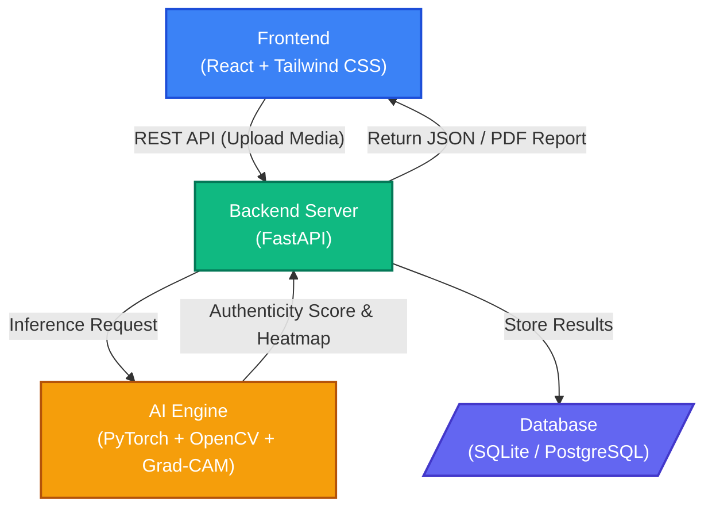

# TrustVision AI - Mini Project Report

## 1. Abstract
TrustVision AI is an enterprise-grade platform designed to detect manipulated digital media (deepfakes) and verify media authenticity. Leveraging modern full-stack architecture and deep learning, it analyzes images and videos to identify manipulations using CNN-based models and provides explainable AI outputs such as Grad-CAM heatmaps.

## 2. Problem Statement and Objectives
The rapid advancement of generative AI has led to a proliferation of highly realistic manipulated media, commonly known as deepfakes. These pose significant threats to digital trust, enabling misinformation, fraud, and defamation. 

**Objectives:**
- To build a highly accurate AI system capable of determining if media is REAL or FAKE.
- To provide Explainable AI (XAI) outputs so users understand *why* media is flagged.
- To offer an intuitive enterprise dashboard for media scanning and reporting.
- To support both image and frame-level video analysis.

## 3. System Architecture

The overarching architecture follows a decoupled client-server model with a dedicated Python-based inference pipeline.

## 4. Technology Stack

### Frontend Module
- **Framework:** React.js (via Vite)
- **Styling:** Tailwind CSS
- **Animations:** Framer Motion
- **HTTP Client:** Axios
- **Routing:** React Router DOM

### Backend API Module
- **Framework:** FastAPI
- **Web Server:** Uvicorn
- **ORM:** SQLAlchemy
- **PDF Generation:** ReportLab
- **Authentication Stack:** JWT (PyJWT), Passlib

### Machine Learning & AI Module
- **Deep Learning Framework:** PyTorch & Torchvision
- **Computer Vision:** OpenCV (cv2)
- **Face Mesh Tracking:** MediaPipe
- **Explainable AI:** pytorch-grad-cam
- **Model Architecture:** A custom fusion network combining features from ResNet50 and Vision Transformer (ViT_B_16), augmented with localized frequency analysis.

### Database Module
- **Database:** SQLite DB (`trustvision.db`) for lightweight local setup. Designed with SQLAlchemy to easily migrate to PostgreSQL for enterprise deployments.

## 5. Detailed Component Design

### 5.1 Frontend Flow
Developed using React, it provides an interactive UI focused on dynamic animations and responsive layout.
- **Analyze Interface:** Users can upload suspect images or video files. The interface polls the backend and renders visual real-time signals, prediction confidence graphs, and overlays the generated Grad-CAM heatmap over the suspect image.
- **Reporting Interface:** Provides options for enterprise users to download comprehensive PDF authenticity reports.

### 5.2 Backend Orchestrator (FastAPI)
Acts as the central nexus routing requests between the client, AI engine, and data storage.
- Exposes `POST /scan` for media upload and synchronous inference routing.
- Exposes `GET /reports/{scan_id}` to dynamically generate and download PDF reports using `ReportLab`. PDF reports detail the metadata, timestamps, risk assessment, and authenticity classification.

### 5.3 Deepfake Detection Engine
The core AI engine logic resides under the `ml/` sub-package. It features an advanced detection pipeline:
1. **Preprocessing & Face Cropping:** Utilizes Haar Cascades and MediaPipe to identify tracking points and focus the analysis tightly on the subject's face.
2. **Deep Feature Extraction:** Passes the image through both a ResNet50 network (for spatial anomalies) and a ViT network (for global patch-based anomalies).
3. **Frequency Domain Checks:** Employs 2D Discrete Cosine Transform (DCT) to detect unnatural repeating frequencies (like checkerboarding), which are characteristic of modern AI generative models.
4. **Physical Texture Checks:** Employs Canny Edge density to analyze micro-textures and identify synthetic, plastic-like smoothness. 

### 5.4 Explainable AI (XAI) Sub-module
A critical feature that prevents the model from acting as a "black box". 
- Integrated with `pytorch-grad-cam`.
- Once inference finishes, gradients flowing into the final convolutional layer are captured to build an attention heatmap.
- This creates an overlay highlighting highly activated regions (e.g., blending anomalies at the jawline or synthetic artifacts in the eyes) that convinced the network a piece of media was faked.

## 6. Conclusion
TrustVision AI successfully demonstrates a highly functional, end-to-end media authentication platform. By prioritizing not only high accuracy but also transparent, explainable results via its generated heatmaps and automated PDF reporting, it stands as a robust tool against digital manipulation and deepfakes.

## 7. Future Scope
- **Audio Deepfake Detection:** Expanding the current visual-only system to analyze voice fingerprints and audio spectrograms.
- **Multimodal Video Detection:** Synchronously assessing visual frame drops with audio desynchronization.
- **WebRTC Integration:** Enabling continuous, live webcam media scanning rather than relying solely on file uploads.
